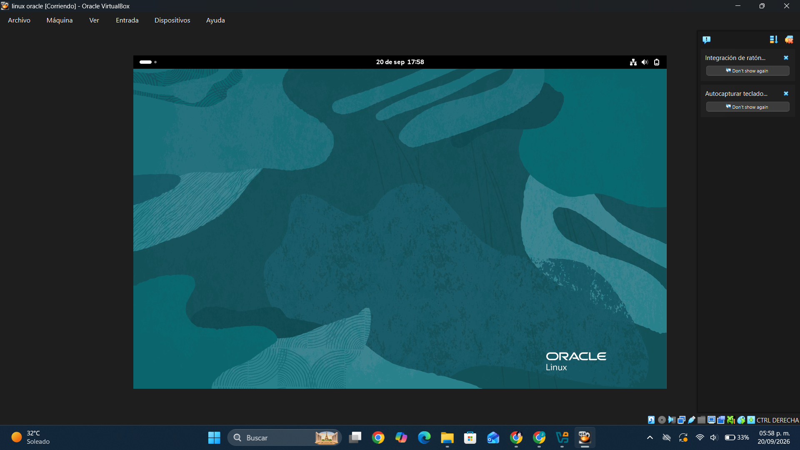

# tallersistemasoperativos
# PRIMERA CLASE
---
## ¿Qué vimos en clase?

El profesor se presento y nos dijo su nombre, por cierto se llama Ismael Jiménez,
es un poco sarcástico xD.

## ¿Qué mas vimos?

Vimos que las estadísticas de las tareas, y que las tareas las checábamos en Discord y xD **Tampoco** se podía mandar monas chinas xD, Tambien nos dijo como debemos usar GitHub y que teníamos que usarlo xDxDXdxDDDDDDD.

---

# Conclsuion

Es muy chistoso el profe

---

# CLASE DOS

---

# ¿QUE VIMOS?

Vimos diferentes sistemas operativos a lo largo de la historia, como los primeros Windows y Mac así como la historia de Linux, diferentes versiones de casa sistema operativo sus servidores así como sus usuarios y lo mas importante distribuciones de Linux.

---
# CONCLUSION 

Buena clase lo malo fue la tarea.

---

# TERCERA CLASE
---
## ¿QUE VIMOS?

El profe califico la tarea xD ni se acordó que había, ahora nos enseño comandos de Linux para expandir nuestra mente, nos enseño comandos como CD, LS y Touch, nos enseño para que servían y eso asi como la estructura de linux y rutas relativas y ruta abosula.

---
## CONCLUSION

Buena la clase la verdad 8.9/10 la verdad

---

# CUARTA CLASE
---

## ¿QUE VIMOS?

Vimos todo lo de GitHub y problemas para iniciar sesión y eso así como el tema ese de GitHub for education y eso y mas cosas de la clase, al profe a veces se le iban las cabras ósea se le olvidaban algunas cosas

---
## CONCLUSION

Medio aburrida la clase la verdad pero fue bastante informativa

---

# QUINTA CLASE

---
## ¿QUE VIMOS?

Vimos operadores lógicos que eran unas tablas que tenían una expresión **A AND B así como OR** también vimos Operadores relacionales ósea como **los <, > ,<=, >=, <>, etc..** muy buena la clase la verdad e informativa la verdad un tema simple a veces al profe se le iban las cabras pero aun así no importa.

---

# CONCLUSION

Buena clase e informativa la verdad me gusto al principio no le entendí pero ya ahora si.

---

# SEXTA CLASE

---

## ¿QUE VIMOS?

Vimos mas cosas y algunos programas del profesor la verdad no me acuerdo mucho de esta clase xD pero solo me acuerdo que el profe andaba de chistoso.

---

## Conclusión

Una clase bastante aburrida la verdad... 5/10

---

# SEPTIMA CLASE

---

## ¿QUE VIMOS?

vimos como usar el GitHub para los que tenían duda de como usarlo, nos enseño el de varias compañeros de la universidad, como teniamos que hacerlo y como no había que hacerle.

---

## CONCLUSION

Clase bastante informativa la verdad 10/10

---
#  OCTAVA CLASE

---

##  ¿Qué vimos?

vimos una demostración de una IA de cámara llamada Halo.
Esta IA se puede utilizar principalmente para **seguridad**, aunque también se puede usar para jugar algunos juegos.

---

##  Conclusión

Me gusto la clase solo que medio me aburri pero me gusto como la **IA** puede hacer eso y mucho mas.

---

# NOVENA CLASE

---

# ¿Qué vimos?

Vimos como dar acceso a linux a usuarios y grupos usando el **CHMOD** y el **CHOWN** que sirve justamente para ese tipo de cosas especialmente si quieres darle permisos a unas personas de hacer cierta tarea.

---

# Conclusion

---

Bastante buena la clase al principio no le entendí y al final tampoco pero bueno después repase y ya entendí jajaja.

---

# DECIMA CLASE

---

# ¿Que vimos?

Vimos un repaso de la materia y algunos otros conceptos que no conociamos etc... bastante buena la clase la verdad un poco extraña pero informativa en el sentido de que si aprendimos o bueno al menos yo si lo hice xd.

---

# Conclusion

Buena clase y preparadisimos para el examen.

---

# FIN DE LA BITACORA

---

